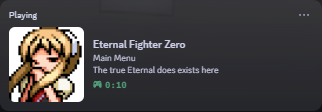
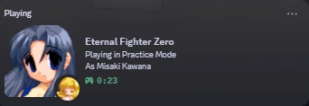
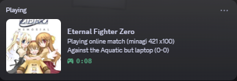
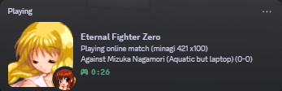
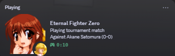
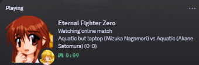

# EfzRichPresence

Windows DLL mod that publishes Discord Rich Presence for Eternal Fighter Zero (EFZ).

It reads EFZ state from process memory and integrates EfzRevival for online status, nicknames, current player side, and set scores.
Currently supports 1.02e, 1.02f, 1.02g, 1.02h!!!, 1.02i!!! and 1.02j versions of EfzRevival.

## Features

- Offline and online presence with clear details/state.
- Netplay export integration (`EFZNetplay_State`) when `efz_netplay_mod` is loaded:
	- Distinct Hosting / Joining / Spectating / Tournament session states.
	- Netplay menu presence and sub-screen tracking (`Main/Host/Join/Nickname/Lobby`).
	- Explicit netplay activity-phase tracking (v4): menu / connecting / delay setup / character select / loading / match.
	- Connected/connecting/failed/session-ended phase tracking for online sessions.
- Characters and nicknames:
	- Large image = your character; Small image = opponent character.
	- If opponent character can’t be read in netplay, state becomes “Against <nickname> …” and the small icon is omitted.
- Scores and orientation:
	- Scores come from EfzRevival and are shown from your perspective as “(you-them)”.
	- Score is always displayed online, starting at 0-0.
- Modes and menus:
	- Replay/Auto-Replay: “Watching replay” and “P1 vs P2”.
	- Offline matches: “Playing in <Mode>”, state “As <P1>”.
	- Main Menu shows a generic EFZ icon.
	- Online pre-pick (before your character is chosen) shows a generic EFZ logo as the large image.
## Build (Visual Studio + CMake)

1. Ensure you have CMake 3.20+ and MSVC installed (VS 2022 or VS 2026).
2. Configure and build the Win32 (x86) preset matching your installed VS:

```powershell
# VS 2026
cmake --preset vs2026-Win32
cmake --build --preset vs2026-Win32
cmake --build --preset vs2026-Win32-debug

# VS 2022
cmake --preset vs2022-Win32
cmake --build --preset vs2022-Win32
cmake --build --preset vs2022-Win32-debug
```

Artifacts will appear under:

```
out/build/<preset>/bin/RelWithDebInfo/EfzRichPresence.dll
out/build/<preset>/bin/Debug/EfzRichPresence.dll
```

Alternatively, configure manually:

```powershell
cmake -S . -B out/build/vs2026-Win32 -G "Visual Studio 18 2026" -A Win32
cmake --build out/build/vs2026-Win32 --config RelWithDebInfo --target EfzRichPresence
cmake --build out/build/vs2026-Win32 --config Debug --target EfzRichPresence
```

Logging can be toggled at configure time:

```powershell
cmake -S . -B out/build/vs2026-Win32 -G "Visual Studio 18 2026" -A Win32 -DEFZDA_ENABLE_LOGGING=ON
```

## Installation
- Place `EfzRichPresence.dll` in your EFZ mods folder (same place you put other EFZ Mod Manager DLLs)
- Add this line to the bottom of `EfzModManager.ini`:
  - `EfzRichPresence=1`
  - EFZ Mod Manager download: [link](https://docs.google.com/spreadsheets/d/1r0nBAaQczj9K4RG5zAVV4uXperDeoSnXaqQBal2-8Us/edit?usp=sharing)

### Linux / Proton

PLEASE KEEP IN MIND THAT THIS WASN'T TESTED

Windows games under Wine/Proton can’t talk to the native Linux Discord UNIX socket directly. Use a tiny bridge to relay Windows named pipes to the Linux Discord socket:

- Bridge: [discord-ipc-bridge](https://github.com/hitomi-team/discord-ipc-bridge)
- Follow its README to install. It can run as a service in your Proton/Wine prefix.
- Optional auto-start from this DLL: set an environment variable with the bridge path before launching EFZ:

	- PowerShell (Windows):
		- `$Env:EFZDA_WINE_BRIDGE = "C:\\path\\to\\winediscordipcbridge.exe"`
	- Steam Proton (Linux):
		- Add to Launch Options: `EFZDA_WINE_BRIDGE=/path/to/winediscordipcbridge %command%`

If the Discord pipe isn’t available at startup, the DLL will attempt to spawn the bridge and reconnect a few times.

## Debug logging

- File logs are disabled by default (`EFZDA_ENABLE_LOGGING=OFF`).
- Enable file logs explicitly with `-DEFZDA_ENABLE_LOGGING=ON`; they are written to `EfzRichPresence.log` beside the DLL (falls back to `%TEMP%` if unwritable).
- Enable live console output by setting `EFZDA_ENABLE_CONSOLE=1` before launching EFZ.
- Netplay transition lines use the `NPTransition:` prefix and show mode/phase/activity/menu/charselect/match/session transitions.
## Runtime behavior (details/state)

- Offline
	- Main Menu: details “Main Menu”; large image `efz_icon`.

	  
	- Replay/Auto-Replay: details “Watching replay”; state “P1 vs P2”; large = P1 character; small = P2 character (tooltip: “Against <P2>”).
	- Matches: details “Playing in <Mode>”; state “As <P1>”; large = your character; small = opponent.

	  
- Online (EfzRevival)
	- Netplay: details “Playing online match (nickname)” if your nickname is known.

	  
	  
	- Tournament: details “Playing tournament match (score)”.

	  
	- Spectating: details “Watching online match”.

	  State is formatted like a replay: `p1Nick (p1Char) vs p2Nick (p2Char) (p1-p2)`.

	  
	- State (Netplay/Tournament): “Against <opponentChar> (oppNick) (you-them)”. If the opponent character can’t be read, shows “Against the <nickname> (you-them)” and omits the small icon. If neither nickname nor character is available yet, shows “Waiting for the opponent...”.
	- Large image: your character; before you pick a character, large image is `210px-efzlogo`.

## License

MIT
