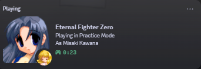
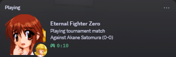

# EfzRichPresence

Windows DLL mod that publishes Discord Rich Presence for Eternal Fighter Zero (EFZ).

It reads EFZ state from process memory and integrates EfzRevival for online status, nicknames, current player side, and set scores.

## Features

- Offline and online presence with clear details/state.
- Characters and nicknames:
	- Large image = your character; Small image = opponent character.
	- If opponent character can’t be read in netplay, state becomes “Against the <nickname> …” and the small icon is omitted.
- Scores and orientation:
	- Scores come from EfzRevival and are shown from your perspective as “(you-them)”.
	- Score is always displayed online, starting at 0-0.
- Modes and menus:
	- Replay/Auto-Replay: “Watching replay” and “P1 vs P2”.
	- Offline matches: “Playing in <Mode>”, state “As <P1>”.
	- Main Menu shows a generic EFZ icon.
	- Online pre-pick (before your character is chosen) shows a generic EFZ logo as the large image.
## Build (Visual Studio 2022 + CMake)

1. Ensure you have CMake 3.20+ and MSVC (VS 2022) installed.
2. Configure and build the Win32 (x86) preset:

```powershell
cmake --preset vs2022-Win32
cmake --build --preset vs2022-Win32
```

Artifacts will appear under:

```
out/build/vs2022-Win32/bin/RelWithDebInfo/EfzRichPresence.dll
```

Alternatively, configure manually:

```powershell
cmake -S . -B out/build/vs2022-Win32 -G "Visual Studio 17 2022" -A Win32 -DCMAKE_BUILD_TYPE=RelWithDebInfo
cmake --build out/build/vs2022-Win32 --config RelWithDebInfo --target EfzRichPresence
```

## Installation
- Place `EfzRichPresence.dll` in your EFZ mods folder (same place you put other EFZ Mod Manager DLLs)
- Add this line to the bottom of `EfzModManager.ini`:
  - `EfzRichPresence=1`
  - EFZ Mod Manager download: [link](https://docs.google.com/spreadsheets/d/1r0nBAaQczj9K4RG5zAVV4uXperDeoSnXaqQBal2-8Us/edit?usp=sharing)
## Runtime behavior (details/state)

- Offline
	- Main Menu: details “Main Menu”; large image `efz_icon`.

	  
	- Replay/Auto-Replay: details “Watching replay”; state “P1 vs P2”; large = P1 character; small = P2 character (tooltip: “Against <P2>”).
	- Matches: details “Playing in <Mode>”; state “As <P1>”; large = your character; small = opponent.

	  
- Online (EfzRevival)
	- Netplay: details “Playing online match (nickname)” if your nickname is known.

	  
	  
	- Tournament: details “Playing tournament match (score)”.

	  
	- Spectating: details “Watching online match”.

	  State is formatted like a replay: `p1Nick (p1Char) vs p2Nick (p2Char) (p1-p2)`.

	  
	- State (Netplay/Tournament): “Against <opponentChar> (oppNick) (you-them)”. If the opponent character can’t be read, shows “Against the <nickname> (you-them)” and omits the small icon. If neither nickname nor character is available yet, shows “Waiting for the opponent...”.
	- Large image: your character; before you pick a character, large image is `210px-efzlogo`.

## License

MIT
